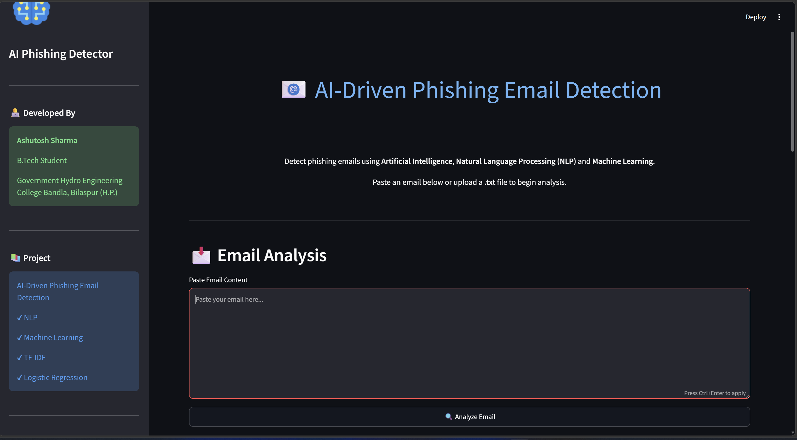
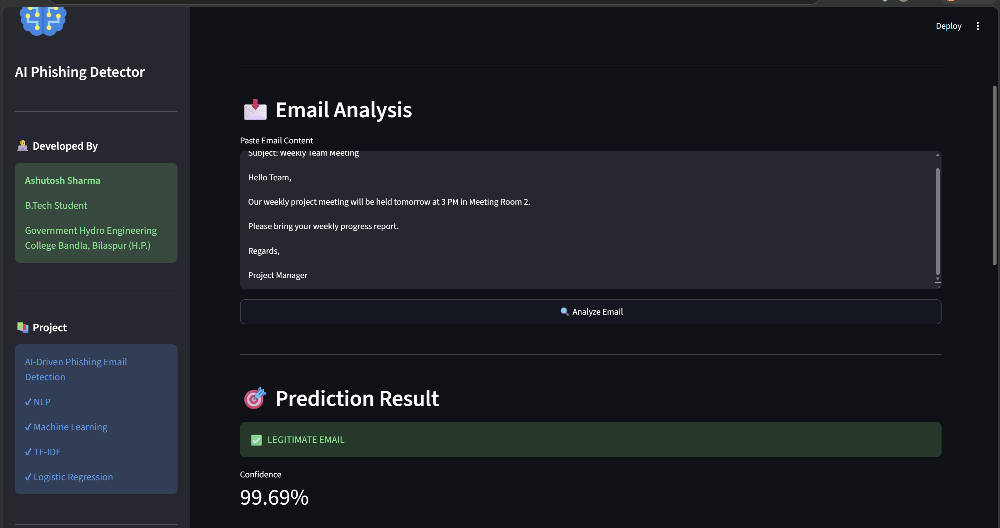
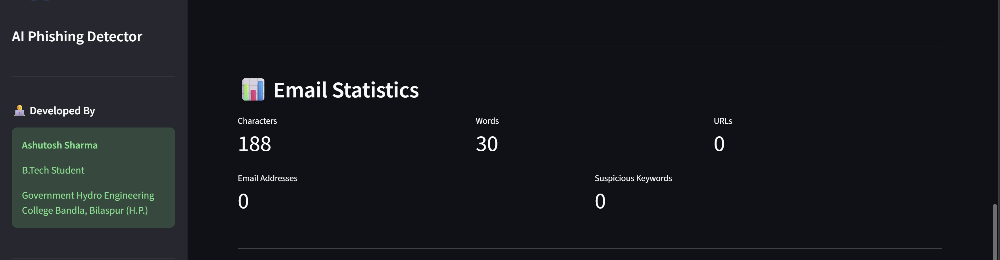

# 🛡️ AI-Driven Phishing Email Detection Using NLP and Machine Learning

## Deployed in Streamlit app : https://ai-driven-phishing--email-detection.streamlit.app/ . 

## 📌 Overview

AI-Driven Phishing Email Detection Using NLP is a Machine Learning-based web application that automatically classifies emails as **Phishing** or **Legitimate**.

The project uses **Natural Language Processing (NLP)** techniques to clean and preprocess email text, converts textual information into numerical features using **TF-IDF Vectorization**, and applies multiple Machine Learning algorithms to identify phishing emails accurately.

The trained model is deployed through a **Streamlit** web application, allowing users to analyze email content in real time with prediction confidence and useful statistics.

---

## ✨ Features

- Detects phishing and legitimate emails instantly
- Text preprocessing using NLP techniques
- TF-IDF feature extraction
- Comparison of multiple Machine Learning models
- Interactive Streamlit web application
- Displays prediction confidence score
- Shows email statistics
- User-friendly interface
- High prediction accuracy

---

## 🎯 Objectives

- Detect phishing emails automatically.
- Reduce the risk of cyber attacks.
- Compare different Machine Learning algorithms.
- Develop a real-time phishing email detection system.
- Provide an easy-to-use web interface for users.

---

## 🛠 Technologies Used

| Category | Technologies |
|----------|--------------|
| Programming Language | Python |
| Machine Learning | Scikit-Learn |
| NLP | NLTK |
| Feature Extraction | TF-IDF Vectorizer |
| Data Processing | Pandas, NumPy |
| Visualization | Matplotlib, Seaborn |
| Web Application | Streamlit |
| Version Control | Git & GitHub |

---

## 🧠 Machine Learning Models

The following algorithms were trained and evaluated:

- Logistic Regression
- Multinomial Naive Bayes
- Random Forest Classifier
- Support Vector Machine (Linear SVM)
- Multi-Layer Perceptron (MLP)

Among all models, **Logistic Regression** achieved the best performance and was selected for deployment.

---

## 📊 Model Performance

| Metric | Score |
|---------|--------|
| Accuracy | 97.95% |
| Precision | 97.78% |
| Recall | 98.30% |
| F1-Score | 98.04% |

---

## 💻 Application Workflow

1. Enter email text.
2. Click **Analyze Email**.
3. Email is preprocessed using NLP.
4. TF-IDF converts text into numerical features.
5. Machine Learning model predicts the result.
6. Prediction, confidence score, and email statistics are displayed.

---

## 📈 Future Improvements

- Deep Learning (LSTM/BERT)
- URL feature extraction
- Attachment analysis
- Email header analysis
- Multi-language phishing detection
- Cloud deployment
- API integration

---

## 👨‍💻 Developer

**Rakesh**

B.Tech (ISE)

NMAM institute of technology , Nitte 

GitHub: https://github.com/rakesh998054 .

---

---

# 📸 Application Screenshots

## 🏠 Home Page

The home page provides a clean and interactive interface where users can enter the email content for phishing analysis.

  

---

## 📧 Email Prediction

After clicking **Analyze Email**, the machine learning model predicts whether the email is **Phishing** or **Legitimate** along with the confidence score.

  

---

## ⚠️ Risk Analysis

The application displays the risk level based on the prediction confidence, helping users understand how dangerous the email may be.

  

---

## 📊 Email Statistics

The application also provides useful statistics such as:

- Total Characters
- Total Words
- Number of URLs
- Email Addresses
- Suspicious Keywords
- Prediction Confidence

  

---
